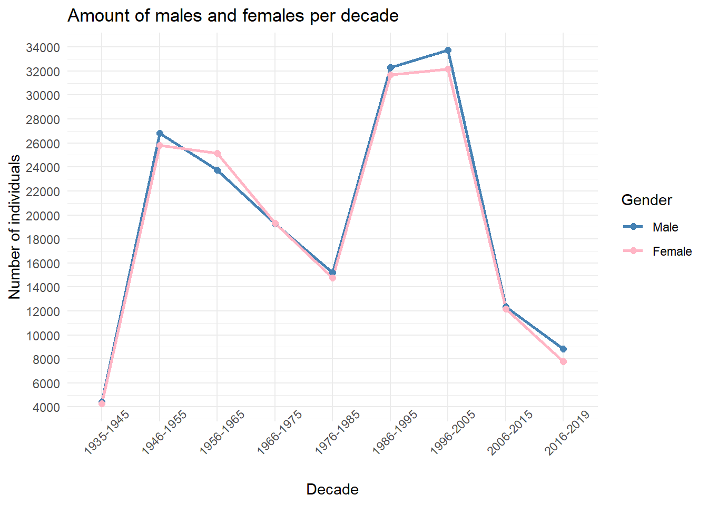
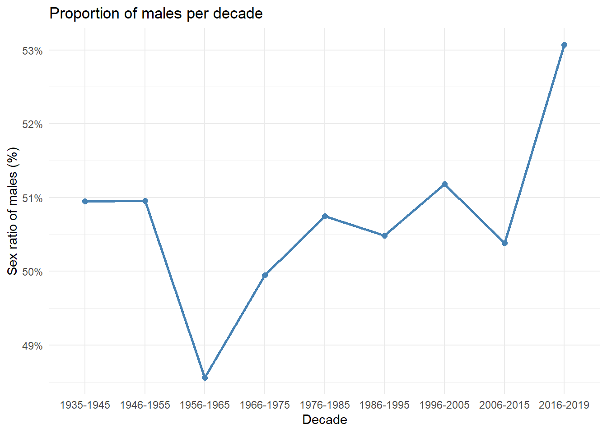

### Biologiske variabler oppdatert 25.09

I dette dokumentet undersøker jeg hvordan biologiske variabler endrer seg over tid. Disse variablene er **lengde, vekt, alder, kjønnsratio**.


::: {.cell}

:::


#### Lengde


::: {.cell}

```{.r .cell-code}
library(dplyr)
library(sf)
library(tidyverse)

herring_data <- readRDS("herring_data.rds")

herring_grouped_decades <- herring_data |> 
  mutate(decade = cut(
    year,
    breaks = c(1935, 1945, 1955, 1965, 1975, 1985, 1995, 2005, 2015, 2019),
    labels = c("1935-1945", "1946-1955", "1956-1965", "1966-1975",
               "1976-1985", "1986-1995", "1996-2005", "2006-2015", "2016-2019"),
    include.lowest = TRUE,  # inkluderer grenseåret 1935
    right = TRUE    #sørger for interval på formen (a,b])
  ))

ggplot(herring_grouped_decades, aes(x = decade, y = length)) +
  geom_boxplot(fill = "skyblue", alpha = 0.6) +
  labs(
    title = "Variation in Herring Length across Timeperiode (Decade)",
    x = "Decade",
    y = "Length (cm)"
  ) +
  theme_minimal()
```

::: {.cell-output-display}
-1.png){width=672}
:::
:::


#### Vekt


::: {.cell}

```{.r .cell-code}
library(dplyr)
library(sf)
library(tidyverse)

herring_data <- readRDS("herring_data.rds")

herring_decades_weight <- herring_data |> 
  mutate(decade = cut(
    year,
    breaks = c(1935, 1945, 1955, 1965, 1975, 1985, 1995, 2005, 2015, 2019),
    labels = c("1935-1945", "1946-1955", "1956-1965", "1966-1975",
               "1976-1985", "1986-1995", "1996-2005", "2006-2015", "2016-2019"),
    include.lowest = TRUE,  # inkluderer grenseåret 1935
    right = TRUE    #sørger for interval på formen (a,b])
  ))

ggplot(herring_decades_weight, aes(x = decade, y = weight)) +
  geom_boxplot(fill = "pink", alpha = 0.6) +
  labs(
    title = "Variation in Herring Length across Timeperiode (Decade)",
    x = "Decade",
    y = "Weight (gram)"
  ) +
  theme_minimal()
```

::: {.cell-output-display}
-1.png){width=672}
:::
:::


#### Alder


::: {.cell}

```{.r .cell-code}
library(dplyr)
library(sf)
library(tidyverse)

herring_data <- readRDS("herring_data.rds")

herring_decades_age <- herring_data |> 
  mutate(decade = cut(
    year,
    breaks = c(1935, 1945, 1955, 1965, 1975, 1985, 1995, 2005, 2015, 2019),
    labels = c("1935-1945", "1946-1955", "1956-1965", "1966-1975",
               "1976-1985", "1986-1995", "1996-2005", "2006-2015", "2016-2019"),
    include.lowest = TRUE,  # include boundary years
    right = TRUE    #intervales with form (a,b])
  ))

ggplot(herring_decades_age, aes(x = decade, y = age)) +
  geom_boxplot(fill = "lightgrey", alpha = 0.6) +
  labs(
    title = "Variation in Herring Length by Timeperiode (Decade)",
    x = "Decade",
    y = "Age (years)"
  ) +
  scale_y_continuous(n.breaks = 13) + #antall streker på y-akse
  theme_minimal()
```

::: {.cell-output-display}
-1.png){width=672}
:::
:::


#### Kjønnsratio

Her starter jeg med å inndele "sex" fra rådata til å vise fordeling av kjønn per år. Deretter viser jeg fordeling av kjønn per tiår over antall individer og kjønnsratio.

I denne koden antar jeg at 1 = hankjønn, 2 = hunkjønn, 4 = feilregistert og NA = ikke registrert.


::: {.cell}

```{.r .cell-code}
library(dplyr)
library(tidyr)

#ifelse statement
#https://www.youtube.com/watch?v=zose3lQAN7o
#https://stackoverflow.com/questions/66173100/how-to-use-ifelse-statements-in-r


herring_data <- readRDS("herring_data.rds")

sex_year_wide <- herring_data |>
  mutate(sex_chr = ifelse(is.na(sex), "NA", as.character(sex))) |> # if there is no sex listed, return "NA", else return the data as a character
  group_by(year, sex_chr) |>
  summarise(n = n(), .groups = "drop") |> # teller antall rader 1,2,4 og NA forekommer
  pivot_wider(names_from = sex_chr, values_from = n, values_fill = 0) # Fyller rader som ellers returnerer NA med 0 slik at man summere over radene senere

show(sex_year_wide)
```

::: {.cell-output .cell-output-stdout}

```
# A tibble: 83 × 5
    year  `NA`   `1`   `2`   `4`
   <dbl> <int> <int> <int> <int>
 1  1935  2516     0     0     0
 2  1936  1932     0     0     0
 3  1937  2181     0     0     0
 4  1938  1255     0     0     0
 5  1939  1331     0     0     0
 6  1940  1384     0     0     0
 7  1941   699     0     0     0
 8  1944    71  2109  2145     0
 9  1945   972  2322  2121     0
10  1946     1  2660  2193     0
# ℹ 73 more rows
```


:::
:::


I denne koden må jeg endre årstallene utfra sex_year_wider og finne optimale 10 år for å demonstrere trender.


::: {.cell}

```{.r .cell-code}
library(dplyr)
library(ggplot2)

herring_data <- readRDS("herring_data.rds")

# Teller antall individer per tiår og fordelt på kjønn
herring_counts <- herring_data |>
  filter(sex %in% c(1, 2)) |>   # beholder kun hankjønn og hunkjønn
  mutate(
    decade = cut(
      year,
      breaks = c(1935, 1945, 1955, 1965, 1975, 1985, 1995, 2005, 2015, 2019),
      labels = c("1935-1945", "1946-1955", "1956-1965", "1966-1975",
                 "1976-1985", "1986-1995", "1996-2005", "2006-2015", "2016-2019"),
      include.lowest = TRUE
    ),
    sex = recode_factor(sex, `1` = "Male", `2` = "Female") # 1 = Male, 2 = Female
  ) |>
  count(decade, sex)   # teller antall rader for hver kombinasjon

# Plot to linjer – en for menn og en for kvinner
ggplot(herring_counts, aes(x = decade, y = n, color = sex, group = sex)) +
  geom_line(linewidth = 1) +
  geom_point(size = 2) +
  scale_color_manual(
    values = c("Male" = "steelblue", "Female" = "pink1")) +
  labs(
    title = "Amount of males and females per decade",
    x = "Decade",
    y = "Number of individuals",
    color = "Gender"
  ) +
  scale_y_continuous(n.breaks = 20) + #antall streker på y-akse
  theme_minimal() +
  theme(axis.text.x = element_text(angle = 45), hjust = 1.5)
```

::: {.cell-output-display}
{width=672}
:::
:::


::: {.cell}

```{.r .cell-code}
library(dplyr)
library(sf)
library(tidyverse)

herring_data <- readRDS("herring_data.rds")

herring_ratio_line <- herring_data |>
  filter(sex %in% c(1, 2)) |>
  mutate(
    decade = cut(
      year,
      breaks = c(1935, 1945, 1955, 1965, 1975, 1985, 1995, 2005, 2015, 2019),
      labels = c("1935-1945", "1946-1955", "1956-1965", "1966-1975",
                 "1976-1985", "1986-1995", "1996-2005", "2006-2015", "2016-2019"),
      include.lowest = TRUE)
  ) |>
  group_by(decade) |>
  summarise(
    proportion_males = mean(sex == 1, na.rm = TRUE)
  )

ggplot(herring_ratio_line, aes(x = decade, y = proportion_males, group = 1)) +
  geom_line(color = "steelblue", linewidth = 1) +
  geom_point(color = "steelblue", size = 2) +
  scale_y_continuous(labels = scales::percent_format()) +
  labs(
    title = "Proportion of males per decade",
    x = "Decade",
    y = "Sex ratio of males (%)"
  ) +
  theme_minimal()
```

::: {.cell-output-display}
{width=672}
:::
:::

